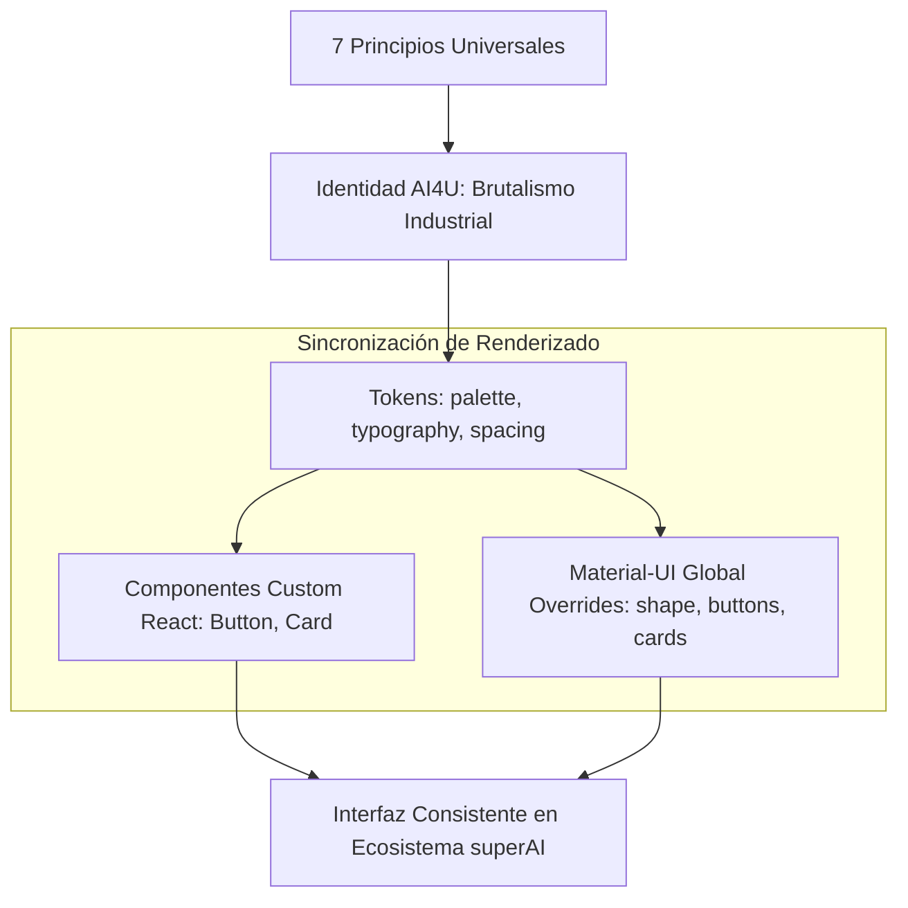

# Manifiesto AI4U: Industrial Software Aesthetics & Specs

Este sistema de diseño no es solo una guía visual; es un manifiesto técnico y estético que dicta la coherencia de toda nuestra infraestructura.

---

## 📜 Reglas de Oro Estéticas

1. **camelCase por Excelencia**: Todas las etiquetas técnicas, IDs de elementos y labels de UI deben seguir la convención `camelCase`. Evitamos el `PascalCase` en etiquetas y prohibimos el `ALL CAPS` (mayúsculas sostenidas).
2. **Estética de Deconstrucción (Abloh Signature)**: Usamos metadatos expuestos, etiquetas de "fase", números gigantes monoespaciados y referencias industriales. El diseño debe sentirse como un plano técnico en ejecución.
3. **Recursos de Software**: El código binario (`101010`), los cursores de consola y las fuentes monoespaciadas son recursos gráficos de primer nivel, no solo decorativos.
4. **Minimalismo Radical / Esquinas Duras**: Bordes a 90 grados (`borderRadius: 0` absoluto) en tarjetas, botones y campos de texto. El espacio negativo es una herramienta funcional y agresiva.

---

## 📐 Especificaciones de Arquitectura Visual



### 🎨 1. Sistema Cromático e Inversión Semántica
El sistema de color se rige bajo una regla sumamente rigurosa definida en [palette.ts](file:///home/ai_tamaprint/Software/clients/AI4U/experiments/superAI/sistemaDiseno/src/tokens/palette.ts):
* **Fondo de Marca:** `mintCream` (`#EAF4EB` — cálido y natural) y `white` (`#FFFFFF` — para elevación).
* **Oscuros / Textos:** `erieBlack` (`#171717` — negro profundo industrial).
* **Inversión Semántica Crítica:**
  * 🟠 **Naranja (`hotOrange` - `#FF6E00`)** representa peligro, error y alerta. **Prohibido usar rojo corporativo en alertas.**
  * 🔵 **Azul (`moderateBlue` - `#3DAED1`)** representa tecnología, éxito e información. **Prohibido usar verde corporativo en feedback de éxito.**
* **Excepción de Telemetría:** Para dashboards y observabilidad en tiempo real, se implementa una subpaleta específica (`telemetry`) que permite el uso universal de verde (`#22C55E` - online), rojo (`#EF4444` - offline) y ámbar (`#F59E0B` - starting), con el fin de evitar errores operativos graves por parte de los administradores de sistemas.
* **Slot Tamaprint:** Incluye la paleta corporativa `tamaprint` para white-labeling en herramientas internas del cliente histórico.

### ✍️ 2. Arquitectura Tipográfica Oficial
Nuestra tipografía combina elegancia display y código crudo en un equilibrio perfecto cargado desde Google Fonts:
* **Fuente Primaria:** `"Red Hat Display", sans-serif` (pesos `300`, `400`, `500`, `700`, `900` para títulos masivos de impacto y cuerpo).
* **Fuente de Código:** `"Necto Mono"` (fuente custom corporativa en base local).
* **Corte de Respaldos (Monospace Fallback):**
  * Para asegurar que los navegadores no rompan el estilo si el archivo local `.otf` de *Necto Mono* falla, se ha integrado **`"Space Mono", monospace`** en el stack de fuentes de código en [typography.ts](file:///home/ai_tamaprint/Software/clients/AI4U/experiments/superAI/sistemaDiseno/src/tokens/typography.ts#L6).
  * `"Space Mono"` se carga automáticamente por CDN desde [index.html](file:///home/ai_tamaprint/Software/clients/AI4U/experiments/superAI/sistemaDiseno/index.html#L9).

### 🛠️ 3. Sincronización del Tema Material-UI (MUI)
Para garantizar la escalabilidad en el ecosistema, se ha unificado la configuración del `ThemeProvider` de MUI en [ThemeContext.tsx](file:///home/ai_tamaprint/Software/clients/AI4U/experiments/superAI/sistemaDiseno/src/context/ThemeContext.tsx) con la estética brutalista de los componentes custom React:

1. **Esquinas Rectas:** `shape.borderRadius` se establece a **`0`** en todo el tema.
2. **Override `MuiCard`:**
   * Eliminación de sombras suaves estándar; los bordes son de `1px solid` en color del tema.
   * Al hacer `:hover`, la tarjeta nativa se traslada `-4px` en X e Y y renderiza una sombra en bloque sólida (`boxShadow: 8px 8px 0px [black/white]`).
3. **Override `MuiButton`:**
   * `borderRadius: 0` global. Peso de fuente agresivo `700`.
   * Variante `outlined` con borde sólido de `2px`.
   * Variante `contained` con efecto `:hover` interactivo que genera una sombra plana a 90 grados y se desplaza `-2px`, coincidiendo de forma idéntica con el componente `<Button>` nativo de nuestra librería.
4. **Override `MuiChip` y Badges:**
   * Fiel a "Brand Book §badges", mantienen la morfología tipo píldora (`borderRadius: '9999px'`) en mayúsculas con espaciado de letras ancho, creando el contraste idóneo con las cajas rígidas de la interfaz.

---

## 🚀 Guía de Consumo para Desarrolladores

### 1. Importación de Componentes Brutalistas
```typescript
import { Button, Card, Giant } from '@ai4u/design-system';

const MyScreen = () => (
  <Card variant="elevated" label="screen_details">
    <Giant>AI4U</Giant>
    <Button variant="primary" label="EXECUTE">
      Procesar Pipeline
    </Button>
  </Card>
);
```

### 2. Uso Exclusivo de Tokens (Para Next.js o no-React)
```typescript
import { AI4U_PALETTE } from '@ai4u/design-system/tokens';

const customStyles = {
  backgroundColor: AI4U_PALETTE.mintCream,
  color: AI4U_PALETTE.erieBlack,
};
```

### 3. Importación de Estilos Base CSS
```typescript
import '@ai4u/design-system/styles';
```
